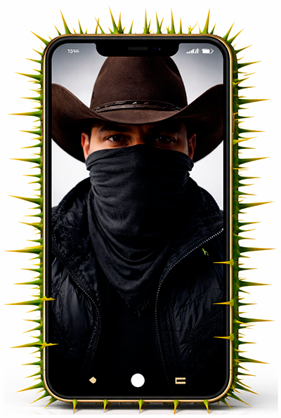
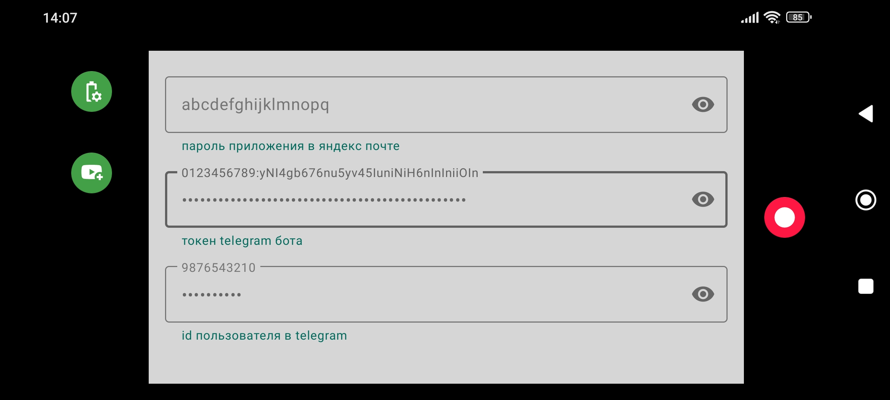

## Приложение для записи коротких видео файлов с отправкой в телеграм чат или яндекс диск.

С помощью приложения вы можете записывать с фронтальной или задней камеры короткие видео с автоматической отправкой в телеграм или яндекс.диск. 
Оно может быть полезным для регистраций противоправных действий с вами или вашим телефоном.

#### Как это работает:
При запуске приложения вам необходимо будет дать разрешения на использование камеры, записи звука и отображение постоянного уведомления.
Доступ к камере и микрофону нужны для создания видео файлов, постоянное уведомление нужно для длительной работы в фоне.
Так же рекомендуется отключить оптимизацию батареи, также для длительной работы приложения в фоне.

После предоставления разрешений, вы можете запустить запись.

Если вы не указали данные для отправки файлов в телеграм или яндекс диск, файлы будут оставаться в папке  /Android/data/com.safelogj.spines/files/video/
пока вы их оттуда не удалите.

Если вы указали данные для отправки файлов в яндекс диск, файлы будут отправляться автоматически при наличии любого интернета (одна попытка)
и не будут удаляться из папки  /Android/data/com.safelogj.spines/files/video/ 
При успешной отправке, файл в яндекс диске обычно появляется через 12 минут.

Если вы указали данные для отправки файлов в чат телеграм, файлы будут отправляться автоматически при наличии любого интернета (пока не отправятся, но не более 2-х суток) 
и после успешной отправки будут удаляться из папки  /Android/data/com.safelogj.spines/files/video/ автоматически.

Если вы указали данные для отправки файлов и в яндекс диск и в чат телеграм, файлы будут сначала отправляться на яндекс диск, а потом в телеграм чат.

В интерфейс приложения с ярлыка на экране можно попасть только при первом запуске, когда у приложения ещё нет разрешений.
Если у приложения есть разрешения, при клике по ярлыку оно сразу будет запускать запись (если она ещё не запущена) с фронтальной камеры.
В этом случае попасть в интерфейс можно только кликнув на постоянное уведомление в статус баре.
Это сделано для того, чтоб можно было быстро запустить приложение сразу после разблокировки телефона, если вас его разблокировать заставили.

#### При работающей записи, приложение автоматически меняет камеру:
- Если приложение находится на экране, запись ведётся с задней камеры.
- Если приложение свёрнуто, запись ведётся с фронтальной камеры.

Запись ведётся всегда когда отображается постоянное уведомление в статус баре.
Длительность записей увеличивается с длительностью работы приложения, от 10 сек первая запись и далее с шагом +10 сек, до 1 минуты максимум.

#### Данные для отправки видео файлов:
Для отправки в чат телеграм, вам надо указать в приложении id пользователя телеграм, который будет получать видео от бота.
Вам надо создать бота в телеграм, указать токен этого бота в приложении и написать этому боту любое сообщение, например /start, с аккаунта, который будет получать видео от бота (чей id вы указали).

Для отправки в яндекс диск, вам надо создать аккаунт (не используйте имеющийся) в яндекс, создать в настройках почты этого аккаунта пароль для приложений с типом WebDAV.
Разрешить доступ к почтовому ящику с помощью почтовых клиентов.
Указать в приложении адрес яндекс почты созданного аккаунта и созданный пароль для приложений.

Подробно в [видео инструкции](https://www.youtube.com/watch?v=XX7zs7j_qgE&list=PL5Ch75WcmOXRW00PyHu-HGdLtBTKdgbeV)

Если иное не требуется применимым законодательством или не согласовано в письменной форме, программное обеспечение,
распространяемое в соответствии с Лицензией, распространяется на условиях «КАК ЕСТЬ»,
БЕЗ КАКИХ-ЛИБО ГАРАНТИЙ ИЛИ УСЛОВИЙ, ЯВНЫХ ИЛИ ПОДРАЗУМЕВАЕМЫХ.
См. Лицензию для получения информации о конкретных условиях и ограничениях, предусмотренных Лицензией.